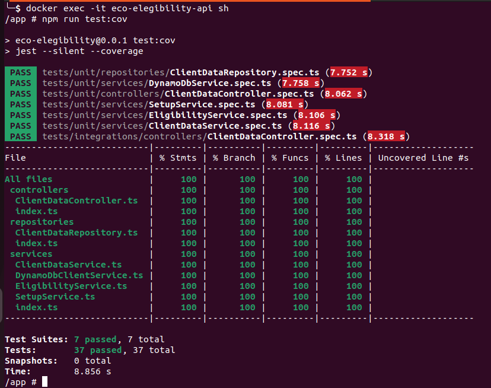

# eco-elegibility API

## 🌱 Descrição do Projeto
Este projeto consiste em uma API que valida a elegibilidade de clientes para utilizar serviços de energia limpa com a Empresa Fictícia de Energia Limpa. A validação é feita com base nos dados da conta de luz do cliente, avaliando se existem razões regulatórias ou práticas que impedem a aceitação do cliente ou se é vantajoso tanto para a Empresa Fictícia de Energia Limpa quanto para o cliente prosseguir com o serviço. A API verifica a elegibilidade e, caso o cliente seja elegível, retorna a projeção de quanto CO2 deixaria de ser emitido caso optasse por energia limpa. Caso contrário, fornece os motivos da inelegibilidade.

## Arquitetura do Projeto
O projeto utiliza o padrão Model-View-Controller (MVC) e o Domain-Driven Design (DDD) para garantir organização e eficiência, especialmente à medida que escala. A adoção do DDD facilita a separação entre lógica de negócios, localizada nos services, e acesso a dados, situado nos repositories. Esta distinção clara evita a mistura de responsabilidades, simplificando a manutenção e a escalabilidade do projeto. Além disso, a estrutura implementada é particularmente vantajosa para aplicações complexas, proporcionando organização, fácil compreensão e flexibilidade na implementação de mudanças ou adição de novas funcionalidades.

### 📁 Estrutura de Diretórios

```plaintext
.
├── docker-compose.yml                  # Define serviços, redes e volumes utilizados pelo projeto Docker.
├── Dockerfile                          # Receita para construir a imagem Docker do projeto.
├── entrypoint.sh                       # Script executado no início do container Docker.
├── instructions                        # Documentação detalhada e recursos adicionais.
│   ├── docker-instructions.md          # Instruções para uso de Docker.
│   ├── print-coverage.png              # Imagem demonstrando a cobertura de testes.
│   ├── server-dynamodb-cloud.md        # Guia para configuração do DynamoDB na nuvem.
│   ├── server-dynamodb-locally.md      # Instruções para rodar DynamoDB localmente.
│   └── serverless-offline.md           # Instruções para rodar o ambiente serverless offline.
├── nest-cli.json                       # Configurações do CLI do NestJS.
├── package.json                        # Metadados do projeto e dependências.
├── README.md                           # Documentação principal do projeto.
├── serverless.yml                      # Configurações para implantação serverless via AWS Lambda.
├── src                                 # Código-fonte principal.
│   ├── AppModule.ts                    # Módulo raiz da aplicação.
│   ├── controllers                     # Controladores que tratam as requisições e respostas.
│   ├── decorators                      # Decorators customizados para uso em classes ou métodos.
│   ├── dtos                            # Data Transfer Objects para transferência de dados na aplicação.
│   ├── enums                           # Enumerações utilizadas para padronizar valores em todo o projeto.
│   ├── filters                         # Filtros de exceções para tratamento centralizado de erros.
│   ├── main.ts                         # Ponto de entrada da aplicação NestJS.
│   ├── models                          # Modelos representando a estrutura de dados.
│   ├── modules                         # Módulos de funcionalidades específicas da aplicação.
│   ├── pipes                           # Pipes para transformação e validação de dados de entrada.
│   ├── repositories                    # Camada de abstração sobre o acesso aos dados.
│   ├── services                        # Serviços contendo a lógica de negócio.
│   └── utils                           # Funções utilitárias e helpers.
├── tests                               # Testes do projeto, incluindo testes de integração e unidade.
├── tsconfig.build.json                 # Configurações do TypeScript para a build.
└── tsconfig.json                       # Configurações do TypeScript para o desenvolvimento.
```

## Documentação do Projeto

O projeto emprega tecnologias de ponta, como Nest.js, Node.js, Serverless Framework, AWS Lambda e DynamoDB. A instalação e execução em ambientes de desenvolvimento e produção são facilitadas pelo uso de Docker e Docker Compose. Para assegurar a qualidade e robustez do código, foram implementados testes de integração e unitários utilizando o  Jest.

- Documentação do Nest.js: [Nest.js](https://docs.nestjs.com/)
- Documentação do Node.js: [Node.js](https://nodejs.org/en/docs/)
- Documentação do Jest:  [Jest](https://jestjs.io/docs/en/getting-started)
- Documentação do Serverless Framework: [Serverless-Framework]()
- Documentação do AWS Lambda: [AWS-Lambda](https://docs.aws.amazon.com/lambda)
- Documentação do DynamoDB: [DynamoDB](https://docs.aws.amazon.com/amazondynamodb)

As versões recomendadas do Docker e Docker-compose para executar este projeto são as que seguem:

```bash
- Docker version 26.0.1, build d260a54
- Docker Compose version v2.5.0
```

Embora essas versões tenham sido usadas para testes, não é estritamente necessário ter exatamente essas versões instaladas. Recomenda-se ter versões recentes para garantir a compatibilidade e evitar possíveis problemas.

Se ainda não foram instalados, siga os links abaixo para instalar:

- Docker: [https://docs.docker.com/get-docker/](https://docs.docker.com/get-docker/)
- Docker Compose: [https://docs.docker.com/compose/install/](https://docs.docker.com/compose/install/)
- Instruções para Linux: [docker-instructions.md](./instructions/docker-instructions.md)

Certifique-se também de ter o Git instalado para clonar o repositório.

## Clonando o Repositório

```bash
git clone git@github.com:yurijcarmo/eco-elegibility-api.git
```

### Critérios de Elegibilidade
Para determinar a elegibilidade, são aplicados os seguintes critérios:

```bash
- Consumption Class (Classe de Consumo): Elegíveis: Commercial, Residential, Industrial.
- Tariff Modality (Modalidade Tarifária): Elegíveis: Conventional, White.
- Minimum Consumption (Consumo Mínimo):
  - Monofásico: ≥ 400 kWh.
  - Bifásico: ≥ 500 kWh.
  - Trifásico: ≥ 750 kWh.
```

A projeção da economia anual de CO2 é calculada assumindo que a geração de 1000 kWh no Brasil resulta em uma emissão média de 84 kg de CO2.

### Instruções para Executar o Projeto

Atenção: Certifique-se de usar um CPF ou CNPJ válido ao fazer os testes, pois um CPF inválido será recusado pela aplicação.

#### Localmente (Serverless Offline):

- Executa a aplicação em modo serverless offline, estabelecendo conexão com o DynamoDB também configurado para operar offline.

- Instruções para executar como Serverless Offline: [serverless-offline](./instructions/serverless-offline.md)

#### Localmente (Servidor Tradicional) – Dynamodb Local:

- Executa a aplicação em um servidor tradicional, conectando-se ao DynamoDB configurado em modo local (offline).

- Instruções para executar como Server Local + DynamoDB Local: [server-dynamodb-locally](./instructions/server-dynamodb-locally.md)

#### Localmente (Servidor Tradicional) – Dynamodb na cloud:

- Executa a aplicação em um servidor tradicional, conectando-se ao DynamoDB hospedado na nuvem AWS.

- Instruções para executar como Server Local + DynamoDB na nuvem: [server-dynamodb-cloud](./instructions/server-dynamodb-cloud.md)


### Executando Testes Unitários

Para executar os testes unitários, acesse o container do projeto com o seguinte comando:

```bash
docker exec -it eco-elegibility-api sh
```
Dentro do container rode:

```bash
npm run test:cov
```

O resultado deverá ser parecido com este:



Show de bola! Não é mesmo? Agora que você já está informado de todas as instruções necessárias, você já pode aproveitar esta API para saber se você é um cliente elegível e o quanto de CO2 deixaria de ser emitido caso optasse por energia limpa. 🌍 

Divirta-se explorando a API!